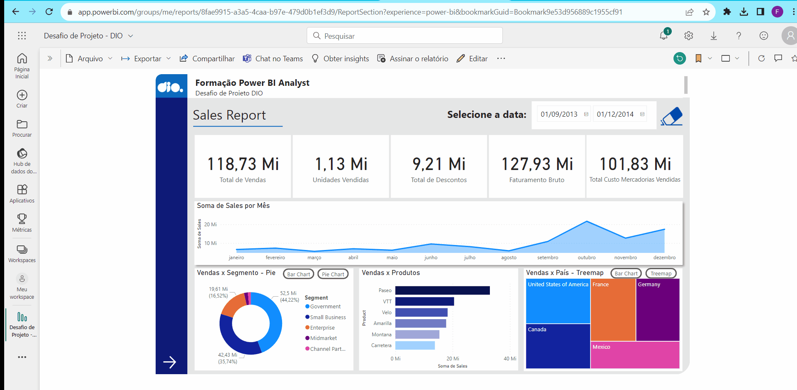

# Desafio de Projeto - ExCriando um Relatório de Vendas Elegante com Power BI - Santander Coders 2023 - DIO

Para acessar o relatório via Power BI: [https://app.powerbi.com/links/5XutBovtZN?ctid=c80aeec9-df0b-47f4-b6c7-d2d1fa3f801b&pbi_source=linkShare](https://app.powerbi.com/links/5XutBovtZN?ctid=c80aeec9-df0b-47f4-b6c7-d2d1fa3f801b&pbi_source=linkShare)

## ✒️Autor
- [Felipe Zanardo](https://github.com/FelipeBZanardo)

## 📋Descrição

Criar um relatório mais elaborado com base na sample financials do Power BI. Os arquivos de dados estão disponíveis no github: [https://github.com/julianazanelatto/power_bi_analyst](https://github.com/julianazanelatto/power_bi_analyst) 

**Fiquem atentos a:** 
- Estrutura definida;
- Botões de navegação que fornecem navegabilidade;
- Segmentadores utilizados e botões com imagem associado;
- Utilize os indicadores e botões para selecionar diferentes visuais sobre um mesmo assunto.

 **Utilize os vídeos de passo a passo para criação dos elementos que compõem a primeira página do relatório:**
- Objetos que definem o layout do relatório;
- Gráficos (visuais) e os campos que os compõem;
- Botões para navegabilidade; 
- Segmentadores de dados.

**Lembre-se de:** 
- Criar a segunda página do relatório;
- Publique o seu relatório no Power BI Service;
- Caso você tenha familiaridade fique livre para utilizar outros artifícios nos botões e outros;
- Submenta seu projeto através do link no github.
  
## Demonstração

  

## 📈 Melhorias futuras

- Criar mais botões e gráficos a partir da base de dados.

